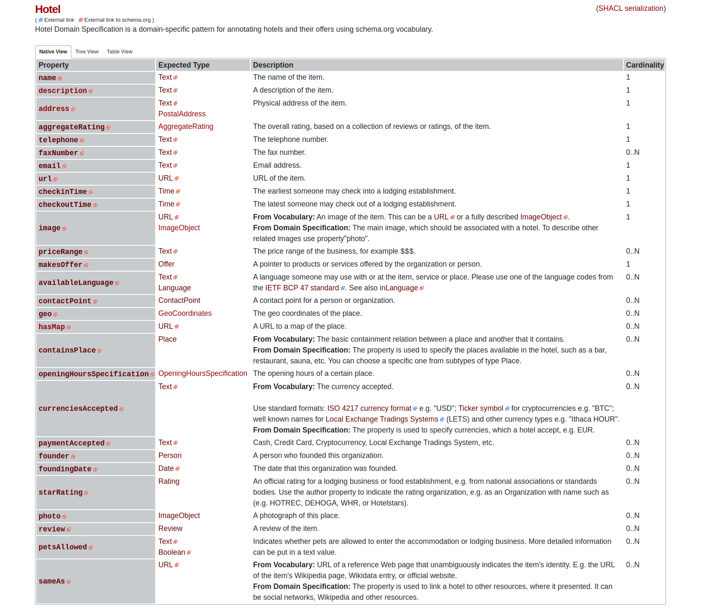

# Domain Specification Browser

## Installation

### Installation via CDN

Add the CSS and the bundled CDN file to your website:

``` html
<link rel="stylesheet" type="text/css" href="https://cdn.jsdelivr.net/gh/semantifyit/ds-browser@76f4c55/ds-browser.css" />
<script src="https://cdn.jsdelivr.net/gh/semantifyit/ds-browser@76f4c55/dist/ds-browser.min.js">
```

## Usage

Use the function `DSBrowser(parametersObject)` to initialize a new DS Browser instance with your wished parameters, then use the function .render() of your created instance to build the DS browser UI in the given target HTML element. 

The parametersObject given for the initialization of the DS Browser has following attributes:

* `targetElement` (mandatory) - the html element in which the DS Browser should be rendered.
* `locationControl` (optional, default: true) - boolean flag, if the URL address should be manipulated for navigation or not

If locationControl is true, then the following parameters will be read from the current URL. If it is false, the following parameters must/can be given in the parametersObject. At least the `listId` or the `dsId` MUST be given.

* `listId` - the id of the DS List hosted at semantify.it which should be rendered (e.g. if the @id of the document is `https://semantify.it/ds/wS4r3c9hQ`, then the listId to pass is `wS4r3c9hQ`)
* `dsId` - the id of the DS hosted at semantify.it which should be rendered (e.g. if the @id of the document is `https://semantify.it/ds/rQHgkTdOr`, then the dsId to pass is `rQHgkTdOr`). It is possible to pick a specific DS of a given List if both listId and dsId are given.
* `path` - the path within the DS that should be shown (e.g. "openingHoursSpecification-OpeningHoursSpecification")
* `viewMode` - the viewmode type that should be rendered (options are `null` for the native view, or `tree` or `table`)
* `format` - the format in which the DS should be rendered (options are `null` for the normal html view, or `shacl` for the raw json-ld representation)
         

``` html
<div id="ds-container"></div>
<script>
    (async function() {
       const dsBrowser = new DSBrowser({
            targetElement: document.getElementById("ds-container"),
            locationControl: false,
            listId: "u0KYwqHQC",
            dsId: "rQHgkTdOr",
            path: "openingHoursSpecification-OpeningHoursSpecification"
        });
        await dsBrowser.render();
    })();
</script>
```

## Screenshot

